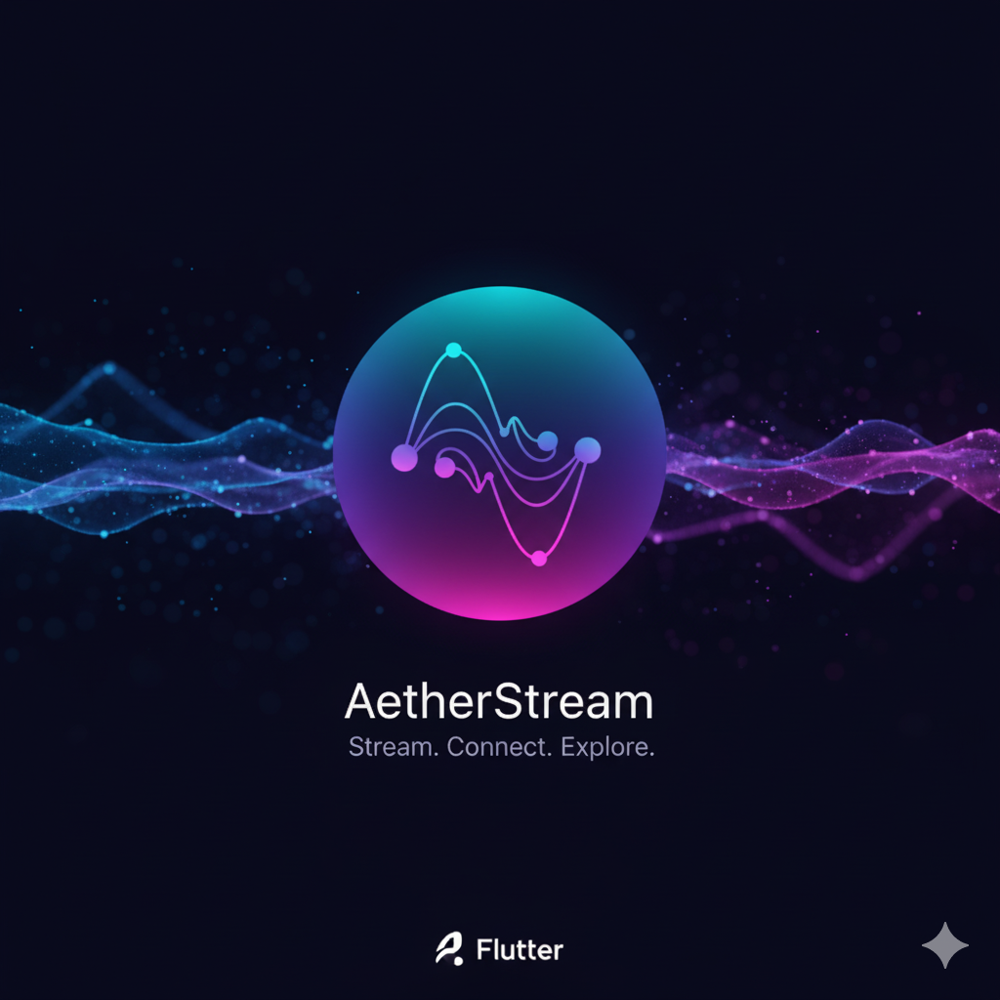

# AetherStream

<p align="center">
  
</p>

<p align="center">
  <strong>Client IPTV Android complet — multi-comptes, EPG, Replay, TMDB</strong>
</p>

<p align="center">
  
  
  
  
</p>

---

## Présentation

**AetherStream** est une application Android construite avec Flutter permettant de regarder des chaînes IPTV, des films et des séries via une playlist M3U ou un serveur Xtream Codes. Elle intègre un système de replay (timeshift), un EPG (guide des programmes), l'enrichissement visuel via TMDB et un gestionnaire de téléchargements.

---

## Fonctionnalités

### 📺 Lecture
- Lecture de flux réseau (HLS, MPEG-TS) et fichiers locaux via **Media3/ExoPlayer** — décodage matériel **Dolby Vision / HDR natif** sur téléviseur, sur `SurfaceView`. Vérifié sur un Philips : 4K Dolby Vision, **zéro image perdue**
- Player plein écran paysage avec contrôles entièrement custom
- **Gestures** : double-tap ±10s, swipe horizontal seek, swipe vertical volume/luminosité
- **Verrouillage écran** : le cadenas désactive aussi les gestes (plus de seek/volume accidentel)
- **Boost audio** : volume amplifiable jusqu'à 200 %, démarrage à 130 % pour compenser les flux IPTV faiblement encodés
- **Synchro A/V** : gérée nativement par ExoPlayer (rendu sur `SurfaceView`) → dialogues calés sur l'image ; le boost 0→200 % passe par `LoudnessEnhancer` Android
- Vitesse de lecture : 0.5x / 0.75x / 1x / 1.25x / 1.5x / 2x
- **Reprise de lecture** : position sauvegardée toutes les 10s, bouton "Reprendre depuis X:XX" + barre cyan sur les vignettes
- **Reprise cross-source** : un film regardé en streaming puis téléchargé reprend à la même position depuis le fichier local (même clé `progressKey: entry.url`)
- **Oublier la reprise** : tile dédiée dans l'action sheet + long-press menu (snackbar UNDO 4s) pour retirer un film/série de la pile Reprendre
- **Épisode suivant** : bouton ▶▶ dans les contrôles séries, et **enchaînement automatique** en fin d'épisode (décompte annulable ; confirmation demandée au changement de saison)
- **Touches média de la télécommande** : PLAY / PAUSE / STOP / ⏩ / ⏪ / ⏭ gérées pendant la lecture (PLAY et PAUSE distincts, pas une bascule)
- **Wakelock** : écran maintenu allumé pendant la lecture, libéré en pause/erreur
- Reconnexion automatique ×3 avec swap automatique d'extension `.ts` ↔ `.m3u8` (compatibilité maximale serveurs)
- Retry réseau coupé en arrière-plan (économie batterie)
- Overlay buffering central avec délai anti-clignotement
- Badge contextuel : 🔴 DIRECT / 🟡 REPLAY / 🔵 FILM / 🟣 SÉRIE
- Barre de progression replay (mode timeshift)

### 📋 Playlist & Comptes
- **Multi-comptes** : plusieurs fournisseurs IPTV simultanément, aggregation automatique en recherche
- **Deux modes** : URL complète M3U ou Xtream Codes (serveur + identifiants)
- Cache playlist 24h (1 fichier par compte) + parsing JSON.gz mémorisé
- Bascule de compte actif réactive : la home se reconfigure dès le changement de priorité
- Recherche et filtres en temps réel — Films / Séries / Chaînes TV
- **Historique de recherche** : 10 dernières requêtes en suggestions (chips dismissibles)
- Regroupement automatique des chaînes par qualité (4K / FHD / HD / SD), dédoublonnage des flux identiques
- Séparation des homonymes par catégorie `group-title` (ex: anime vs live-action) avec badge visuel

### ⏪ Replay / EPG
- Timeshift Xtream Codes avec picker manuel (jour + heure + durée + qualité FHD/HD/SD)
- **Grille EPG XMLTV** : sélection directe d'un programme dans la grille pour le replay
- EPG "En cours / Ensuite" dans la fiche chaîne via XMLTV (source TNT France, cache 12h)
- Détection automatique du meilleur format de flux (`.ts` prioritaire, fallback `.m3u8`)
- Support des formats catchup : Xtream Codes path-based et Flussonic (`{utc}/{lutc}`)

### 🎬 TMDB
- Enrichissement automatique : affiches, synopsis, **casting avec photos**, bande-annonce YouTube (ouverture dans l'app YouTube)
- Recherche intelligente en 4 passes (type, année, langue...)
- Désambiguïsation par année et genre `group-title` (évite les confusions films/séries homonymes)
- Fiche épisode : still TMDB, titre épisode, note ★, date de diffusion, synopsis
- Fiche détail film/série avec crédits complets + bouton **♥ Favori** + reprise de lecture intégrée
- Squelettes (skeleton placeholders) pendant le chargement TMDB pour éviter les sauts d'UI

### 🏠 Accueil streaming-style
- **Hero "jeu de cartes"** (films/séries) : pile de 10 cartes empilées en éventail avec effet 3D (padding blanc "papier" 3px + box-shadow stack simulant l'épaisseur). 5 cartes "Reprendre" triées par dernière lecture + **tendances TMDB de la semaine présentes dans la playlist** (matching exact, cache 24h ; repli sur les nouveautés si pas de clé TMDB)
- **Swipe horizontal** sur le hero pour naviguer manuellement entre les cartes (pause auto-rotation pendant le drag, snap avec biais de vélocité au relâché)
- Auto-rotation 6 s entre les cartes (continue après un swipe manuel)
- Hero 16/9 classique conservé sur la page Chaînes (live)
- Hero remonte jusqu'à la status bar (l'icône ⚙️ flotte par-dessus, l'inclinaison libère le coin haut-droit)
- 3 pages swipeables : Séries / Films / Chaînes (PageView + tabs animées sous le hero)
- Catégories triées : ⭐ Favoris → 🇫🇷 France (TV) → 🔥 New → genres → Autres
- Films/Séries en carrousels horizontaux (poster 2:3), Chaînes en grille 3 colonnes (logo carré)
- Limite 25 items par section + tile "Voir tout" qui ouvre la liste complète. **Favoris sans plafond** (curation utilisateur)
- Tuile **REPRENDRE LA CHAÎNE** en tête de la page Chaînes (dernière chaîne TV regardée)
- Long-press sur une carte → menu contextuel (Lire/Reprendre, Oublier la reprise, Voir détails, Télécharger, Favori)
- Recherche in-place via la NavigationBar (pas de page séparée)
- Onboarding 3 écrans au tout premier lancement (welcome / playlist / TMDB)
- AppBar épurée (nom de compte retiré — visible dans Settings → Comptes uniquement)

### ❤️ Favoris
- Films, séries **et** chaînes TV (cross-comptes, cross-variantes)
- Auto-ajout au lancement de la lecture (silencieux)
- Long-press menu sur les cartes + icon-button compact dans la fiche détail
- Section ⭐ Favoris dupliquée en tête de la page concernée
- Stockage `SharedPreferences` (clé canonique `<type>|<groupKey>`)

### ⬇️ Téléchargements
- Téléchargement avec suivi de progression
- Reprise sur interruption (header `Range`)
- **Relance automatique quand le débit s'effondre** (§dlWatchdog) — un serveur qui bride ne provoque jamais d'erreur, le transfert rampe : l'app détecte le décrochage et reconnecte seule au même octet, sans rien afficher d'autre qu'un compteur de relances
- Sauvegarde dans `/Movies/AetherStream/` via MediaStore Android

### 🔄 Mise à jour in-app
- Vérification automatique au démarrage via l'API GitHub Releases
- Téléchargement et installation de l'APK directement depuis l'application

### 🔒 Sécurité & confidentialité
- **SSL bypass scoped** : accepté uniquement pour les serveurs IPTV utilisateur, jamais pour TMDB/GitHub/XMLTV (HTTPS strict)
- **`network_security_config.xml`** : cleartext interdit sur les APIs publiques connues
- **`allowBackup="false"`** + règles d'extraction excluant tout → pas de fuite credentials via `adb backup`
- **Logs sanitisés** : `redactUrl()` / `redactServer()` masquent `user:pass` dans logcat
- **Stockage chiffré** des comptes IPTV et clé TMDB (`flutter_secure_storage` / EncryptedSharedPreferences)

---

## Installation

### Depuis les Releases GitHub

Télécharge `aetherstream.apk` depuis la page [Releases](https://github.com/JuMANocta/2025_dwl_iptv_flutter/releases) et installe-le directement sur ton appareil Android (minSdk 24 — Android 7.0+).

Compatible **smartphones, tablettes, Fire Stick et Android TV** (Philips, Sony, etc.) — toutes architectures ARM64 / ARMv7 / x86_64.

> ⚠️ L'installation d'APK hors Play Store nécessite d'activer **"Sources inconnues"** dans les paramètres Android.

### Depuis les sources

```bash
# Cloner le dépôt
git clone https://github.com/JuMANocta/2025_dwl_iptv_flutter.git
cd 2025_dwl_iptv_flutter

# Installer les dépendances
flutter pub get

# Lancer en debug
flutter run

# Build APK universel (téléphone + TV + Fire Stick)
flutter build apk --release
```

---

## Configuration

### 1. Ajouter un compte IPTV

Au premier lancement, l'application redirige vers la page de gestion des comptes. Deux modes disponibles :

- **URL complète** : colle l'URL de ta playlist M3U
- **Xtream Codes** : renseigne le serveur, le nom d'utilisateur et le mot de passe

### 2. Clé API TMDB *(optionnel)*

Pour bénéficier des affiches, synopsis et informations TMDB :

1. Crée un compte sur [themoviedb.org](https://www.themoviedb.org)
2. Génère un **Bearer Token (API Read Access Token v4)**
3. Renseigne-le dans **Paramètres → Clé API TMDB**

> Sans clé TMDB, l'application fonctionne normalement mais sans enrichissement visuel.

### 3. Paramètres

Toutes les options sont regroupées dans **⚙️ Paramètres** (icône en haut à droite de l'accueil) :
- **Comptes IPTV** : gestion des providers + compte actif
- **Clé API TMDB** : token Bearer + lien direct vers la page d'inscription
- **Guide des chaînes** : statut + refresh du cache XMLTV
- **Personnalisation** : thèmes + 5 presets (Matrix, Blade Runner, Tron, Minimaliste, Classic)
- **Statistiques playlist** : nombre de films/séries/chaînes du compte actif
- **Recharger la playlist** : force le retéléchargement
- **À propos** : version + check des mises à jour manuel

---

## Architecture

```
lib/
├── main.dart                          # Point d'entrée + _LaunchDecider (onboarding / accounts / home)
├── core/
│   ├── navigation/main_navigation.dart # NavigationBar 3 onglets (Accueil / Recherche / Téléchargements)
│   ├── themes/                        # colors.dart, themes.dart, AppThemeConfig, AetherThemeExtension
│   └── utils/                         # NetworkUtils (SSL bypass scoped), log_sanitizer, SecureStorage
├── data/
│   ├── models/                        # StreamAccount, M3uEntry, ParsedPlaylist, Media, DownloadTask, XmltvProgram
│   └── services/                      # Tous statiques/singletons :
│        ├── StreamAccountService      #   comptes IPTV + currentAccountIdNotifier
│        ├── PlaylistService           #   cache M3U 24h, multi-comptes
│        ├── ParsedPlaylistService     #   hub central JSON.gz + mémoire (entriesWithPriority)
│        ├── DownloadManagerService    #   Dio stream + reprise + MediaStore
│        ├── TmdbService / TmdbApiService #   recherche TMDB 4 passes + Bearer Token
│        ├── ReplayService             #   Xtream timeshift + EPG short
│        ├── XmltvService              #   EPG TNT France (cache 12h)
│        ├── FavoritesService          #   §1d favoris cross-comptes
│        ├── WatchProgressService      #   §1e reprise (save 10s + dispose)
│        ├── SearchHistoryService      #   §1i historique recherche
│        ├── LastWatchedChannelService #   §1i dernière chaîne TV
│        └── UpdateService             #   MAJ in-app GitHub Releases
├── feature/
│   ├── accounts/                      # AccountsPage (§1g refondue), EditAccountSheet, PlaylistManagementPage
│   ├── downloads/                     # Gestionnaire de téléchargements
│   ├── home/home_page.dart            # Hub principal : carrousels, hero, recherche in-place
│   ├── onboarding/onboarding_page.dart # §1i — 3 écrans au 1er lancement + OnboardingService
│   ├── player/                        # PlayerPage + interface AetherPlaybackEngine + Media3Engine + widgets (lifecycle §1h, buffering, etc.)
│   ├── replay/                        # ReplaySheet + ReplayDatePickerSheet
│   ├── search/                        # M3uParser, M3uFilter (dedupeTvVersions), DetailsPage, ActorDetailsPage
│   ├── settings/                      # SettingsPage (hub), ThemeSettings, TmdbKey (§1g), Xmltv (§1g)
│   └── update/                        # Mise à jour in-app (GitHub Releases)
├── widgets/                           # MediaActionSheet (+_FavoriteToggleTile, _PlayResumeTiles, _SkeletonLine),
│                                      # MediaCard, MediaChips, QualityButtons, EpgBlock, TerminalDownloadDialog
└── l10n/                              # Traductions FR / EN
```

### Stack technique

| Composant | Package |
|-----------|---------|
| HTTP / Téléchargements | `dio` |
| Player vidéo | **Media3/ExoPlayer** vendoré (`packages/aether_video`) — seul moteur depuis 2026-09-01 |
| Luminosité | `screen_brightness` |
| Wakelock | `wakelock_plus` |
| Stockage sécurisé | `flutter_secure_storage` |
| Préférences | `shared_preferences` |
| MediaStore Android | `media_store_plus` |
| EPG XMLTV | `xml` |
| Polices | `google_fonts` |
| Permissions | `permission_handler` |

---

## Roadmap

### ✅ Terminé
- [x] **L'application pèse un tiers de moins** (§apkDiet + §ramDiet, 2026-09-02) — L'installateur passe de **62,8 à 40,2 Mo**. L'essentiel du poids n'était ni les images ni le code, mais le fait que la partie native du lecteur vidéo était compilée pour **trois architectures de processeur** là où deux suffisent : la troisième n'existe que sur émulateur, et elle coûtait 21,5 Mo à elle seule. Retirée, avec les traductions de 84 langues que l'application ne peut pas afficher, 636 Ko d'images d'écran de démarrage que plus rien ne référençait, et trois composants installés mais jamais appelés. Côté mémoire, l'analyse d'une liste de 121 000 titres réservait **319 Mo d'un coup**, parce qu'elle gardait en même temps le fichier entier, sa conversion et son découpage en lignes. Elle le lit désormais au fil de l'eau : **165 Mo mesurés**, pour un résultat identique titre par titre. S'y ajoute la mise en commun des valeurs qui se répètent — une catégorie, une qualité, un nom de compte étaient recopiés autant de fois qu'il y a d'entrées
- [x] **Corrections du tour post-migration** (§tourFix, 2026-09-02) — Douze défauts trouvés en auditant l'application après le changement de moteur vidéo. Les plus visibles : choisir un profil de performance **réactivait l'enchaînement automatique des épisodes** qu'on avait coupé ; le badge de vitesse du lecteur restait **figé à 1.0x sur téléviseur** parce que deux compteurs de vitesse vivaient en parallèle sans se parler ; le **verrouillage du lecteur n'empêchait pas la télécommande d'agir** ; sur la page Optimisation chaque réglage avait **deux arrêts de télécommande** au lieu d'un, dont un invisible ; et l'encart « Infos vidéo » affichait quatre lignes qui ne pouvaient plus rien contenir, plus un « HDR : oui » écrit en dur qui s'affichait même sur un film sans HDR. Deux correctifs de **confidentialité des journaux** au passage : les identifiants du fournisseur pouvaient encore apparaître en clair dans le journal — servi en HTTP sur le réseau local — pour les chaînes TV, et l'ensemble des journaux partait vers le système même en version publiée
- [x] **Fini les morceaux de code technique dans les titres** (§tagResidue, 2026-08-30) — Des titres s'affichaient « Toy Story 5 [ VQF/] » ou « Superman [ A/V] » : le nettoyage des étiquettes techniques retirait ce qu'il connaissait et laissait le reste. Pire, ce résidu entrait dans la clé de regroupement, donc le même film **ne fusionnait plus** d'une liste à l'autre — la cause de nombreux doublons. **1 266 titres** étaient abîmés sur 353 475, il n'en reste aucun. Corrigé au passage : `[REC]` — un vrai titre de film — était détruit par une règle qui croyait reconnaître un code langue, et le film s'affichait alors avec toutes ses balises
- [x] **Un même film en deux langues n'est plus deux vignettes** (§tmdbMerge + §tmdbField, 2026-08-30) — « 100 METERS » et « 100 Mètres », c'est le même film ; aucune comparaison de texte ne peut le deviner, mais l'identifiant TMDB le dit. **11 528 titres** se réunissent désormais sous une seule fiche, avec toutes leurs versions. Découvert en chemin : un fournisseur envoie cet identifiant sous un autre nom, et l'application le jetait — **16 650 identifiants** étaient perdus, ce qui privait ces titres de leur affiche et de leur synopsis
- [x] **On voit enfin quelle version va être lue** (§versionSelected, 2026-08-30) — Sur la fiche d'un film, la version choisie ne se distinguait que par une nuance de fond invisible à trois mètres d'un téléviseur — et le halo du curseur se confondait avec elle, si bien que la version survolée avait l'air d'être la version choisie. Chaque version porte maintenant une pastille cochée, indépendante du curseur
- [x] **Sortir d'une chaîne ramène au bon endroit** (§tvExitPage, 2026-08-30) — Sur Android TV, quitter une chaîne renvoyait sur l'onglet **Films**, à une position quelconque de la liste. Deux causes : le lecteur mémorisait, comme point de retour, un bouton de la fenêtre d'options **en train de se fermer** (elle détient encore le focus au moment où le lecteur s'ouvre) ; et les rangées de l'accueil n'avaient pas d'identité stable, si bien que l'ajout automatique aux favoris décalait tout et ramenait sur une **autre chaîne**. On revient désormais exactement sur la carte lancée, sans que la liste bouge. Corrigé aussi : la barre Séries/Films/Chaînes ne glisse plus toute seule quand on navigue à la télécommande
- [x] **Journal de diagnostic enfin lisible** (§focusName, 2026-08-30) — Le traceur de focus affichait `focus → Focus` pour absolument tout, ce qui le rendait inutilisable — il nomme désormais l'élément visé (`« TF1 » FocusableCard`). C'est ce qui a permis de trancher le bug ci-dessus en une session au lieu de six semaines
- [x] **Nouvelle liste absorbée sans doublons** (§xenoFormat + §yearTitle, 2026-08-28) — Un 4e fournisseur nomme ses titres autrement (`FR| Lanterns` au lieu de `Lanterns`, tags `[MULTI-SUB]`) : ses films et séries n'étaient donc jamais reconnus comme les mêmes œuvres que sur les autres listes. Après correction, **13 191 films** et **5 336 séries** fusionnent avec le catalogue existant (contre 165 et 3 avant), et **3 642 doublons internes** disparaissent. Corrigé au passage : un film dont le titre est une année (« 2067 », « 1917 ») s'affichait sous son étiquette technique — 28 titres étaient illisibles, il n'en reste aucun
- [x] **Le code pays n'est plus affiché comme une qualité vidéo** (§providerTag + §camQuality + §orphanBracket, 2026-08-28) — « Regarder · FR » s'affichait là où on attend « Regarder · FHD » : le marqueur de tête du fournisseur (FR, US, IT, RU…) était rangé dans un champ fourre-tout que l'interface lit comme une qualité. Il a désormais son propre champ et sa propre pastille — **137 459 titres** concernés. Dans l'autre sens, les rips de salle (HDTS, HDCAM, CAMRIP) **sont** une qualité et n'étaient pas détectés du tout : **188 titres** l'affichent maintenant, classés en dernier pour ne jamais être proposés par défaut. Corrigé au passage : un tag refermé par un délimiteur jamais ouvert (`… |HDTS]`) laissait un résidu dans le titre affiché — **120 titres**, dont « Spider-Man : Brand New Day - ] »
- [x] **L'étiquette de version ne recopie plus le titre du film** (§labelLeak + §invisibleLead, 2026-08-28) — En vérifiant le point précédent, **11 375 titres sur 11 389** affichaient leur propre nom en guise d'étiquette de version. L'étiquette se calculait en retranchant le titre nettoyé du titre brut, ce qui échouait dès qu'un double espace, une année en milieu de titre ou un tag interne les faisait diverger. Il ne reste plus que **5 étiquettes**, toutes légitimes ou inoffensives (« Directors.Cut »)
- [x] **Les titres ne sont plus amputés de leur année ou de leur « 3D »** (§midYear + §keep3d, 2026-08-28) — « Star Ac Tour 2026, le concert » s'affichait « Star Ac Tour , le concert » et « Winx Club 3D » perdait son « 3D » : le nettoyage confondait une année qui fait partie du nom avec la date de sortie. **4 603 titres** retrouvent leur année et **65** leur « 3D ». La date de sortie reste correctement détectée : elle est entre parenthèses, ou en fin de ligne
- [x] **Recherche TMDB réparée : les films retrouvent leur date** (§midYearFix, 2026-08-29) — Un correctif de la veille avait fait perdre leur année de sortie aux titres suivis d'une balise fournisseur (`The Whisper Man - 2026 [MULTI-SUB]`). Or l'année est ce qui distingue deux films homonymes : sans elle, la fiche TMDB partait sur le mauvais film ou restait vide. Vérifié sur 155 000 titres réels
- [x] **Écran de démarrage refondu** (§bootShell, 2026-08-17) — Un décor unique et soigné pour **tous** les états de lancement : chargement, aucun compte, erreur. Auparavant seul le chargement était travaillé, les deux autres tombaient sur du Material brut (icône rouge codée en dur, `AppBar`, boutons à peine focusables à la télécommande). Nouveau **journal de démarrage** : les étapes franchies restent affichées **avec leur durée**, l'étape en cours a son curseur et son pourcentage. Tout suit le thème choisi — le preset Minimaliste obtient une version sobre, sans halo ni scanlines. Enfin **lisible sur TV** (le wordmark et le texte étaient dimensionnés pour un téléphone)
- [x] **Lancement sans aucun flash** (§splashHandoff, 2026-08-17) — La fenêtre affichée par Android avant le premier rendu Flutter est incompressible (elle existe le temps que le moteur démarre), mais elle prend désormais **exactement la couleur de l'écran de démarrage**, en mode clair comme en mode sombre. Elle devient donc invisible : l'application semble s'ouvrir directement sur son écran de démarrage. Fini la marche à l'arrivée, et fini le flash blanc quand le téléphone est en thème clair
- [x] **Démarrage plus rapide à l'affichage** (§bootFast, 2026-08-17) — L'écran apparaît désormais **immédiatement** : seuls la détection de plateforme et le thème sont attendus avant le premier rendu. Les neuf services, MediaKit et MediaStore s'initialisent ensuite, visibles dans le journal — avant, on regardait la couleur du splash système pendant toute cette phase
- [x] **Épisode suivant automatique + infos qui suivent la lecture** (§episodeMeta/§autoNextEp, 2026-08-17) — À la fin d'un épisode, le suivant s'enchaîne après un **décompte annulable**. Un changement de **saison** demande toujours une confirmation explicite, et la fin de série ramène à la fiche. Le changement d'épisode se fait désormais **sans recharger le lecteur** (plus d'écran noir ni de re-buffering entre deux épisodes) — ce qui corrige au passage le titre et le synopsis qui restaient ceux de l'épisode précédent. Réglable dans Paramètres → Optimisation
- [x] **Rafraîchissement des listes secondaires** (§secondaryRefresh, 2026-08-17) — Le cache de 24 h ne s'appliquait qu'au compte principal : la playlist d'un compte secondaire, une fois téléchargée, ne se mettait **jamais** à jour. Elle est désormais revérifiée au démarrage comme les autres, et rafraîchie immédiatement quand on passe le compte en principal ou qu'on vide son cache
- [x] **Navigation télécommande alignée + touches média** (§dpadAlign, 2026-08-14) — Le retour ne « recharge » plus la page : le focus revient **sur la carte d'où l'on est parti** (une mémoire de focus par route remplace le repli du package D-pad, qui retombait toujours sur la 1re vignette de l'accueil en faisant défiler la liste en haut). Un seul chemin pour le bouton Retour (physique, télécommande web, bouton du player). Les touches **PLAY / PAUSE / STOP / avance / recul / piste suivante** de la télécommande sont enfin gérées — elles n'étaient captées nulle part. Alignement D-pad des écrans oubliés : tous les dialogs de confirmation, les feuilles Replay, la grille « Voir tout », l'onboarding
- [x] **Journal de diagnostic TV** (§tvLogs, 2026-08-14) — Android TV n'expose pas de logcat : le journal de l'application se consulte désormais **depuis le téléphone** via la Console web, et s'exporte en `.txt`. Inclut un **traceur de touches** pour voir ce que la télécommande émet réellement. Les identifiants (URLs de playlist, mots de passe) sont masqués avant d'entrer dans le journal
- [x] **Refonte complète du player** — `media_kit`, contrôles custom, gestures, reconnexion auto *(PiP reporté)*
- [x] **Mise à jour in-app** — vérification + téléchargement APK depuis GitHub Releases
- [x] **Grille EPG XMLTV** — sélection programme dans la grille pour le replay
- [x] **Refactoring recherche** — modules séparés (parser, filter, widgets) puis suppression du code mort `recherche_page`/`recherche_m3u` (lot A, 2026-06-11)
- [x] **Système de thème sémantique** — variables `kAccentPrimary/Secondary/Tertiary`, constantes qualité/langue/badges centralisées
- [x] **Thème personnalisable in-app** — `AppThemeConfig` runtime + page Personnalisation : **9 presets** (Matrix, Blade Runner, Tron, Cyberpunk, Synthwave, Phosphore, Nordique, Minimaliste, Classic) et **7 couleurs réglables** dont les couleurs d'état favori ❤ / reprise-alerte / erreur / succès appliquées sur tout le front (§themePlus, 2026-06-11)
- [x] **Téléchargement playlist via JSON API Xtream** (§xtreamApi, 2026-06-04) — Au lieu de tirer `get.php` (qui retourne souvent HTTP 500 silencieux sur les gros panels à cause du timeout PHP), AetherStream construit la playlist en interne via les endpoints `player_api.php?action=…` (live + VOD + séries, 6 actions en parallèle). C'est ce que font tous les clients IPTV modernes (TiviMate, IPTV Smarters Pro, ZenIPTV…). Marche sur des panels où `get.php` ne marche pas. Fallback automatique sur `get.php` pour les providers non-Xtream. Profil de requête `User-Agent: IPTVSmartersPro` (whitelisté par les panels). **Séries** : 1 entrée par série au boot, épisodes chargés à l'ouverture de la fiche (lazy load)
- [x] **Catalogue unifié JSON direct** (§23, 2026-06-10) — les réponses `player_api.php` sont sauvegardées brutes (`playlist_<id>.json`) et parsées **directement** en entrées (plus de round-trip M3U texte) : zéro perte de métadonnées (tmdb_id, synopsis, note, genres, casting, backdrops, replay `tv_archive`). Regex de titre réécrites sur les formats réels des 3 providers (préfixes composés `|FR-4K DV|`, `|VO|STFR|`, suffixes `(MULTI) FHD 2025`, `[MULTi]`, `_sub`) → un même film présent sur plusieurs listes fusionne en **une seule vignette** (8 600+ films communs validés). Image affichée = celle de la **plus grosse liste** (fallback automatique). Fiche film/série complète (synopsis, note, genres) **même sans clé TMDB**. Fallback `get.php` conservé pour les comptes non-Xtream
- [x] **Catégories M3U** — chips de filtre par catégorie dans la recherche (films + séries)
- [x] **Filmographie acteur DISPO** — badge sur les films présents dans la playlist + navigation `DetailsPage`
- [x] **Fiche TMDB même hors listes** (§tmdbOnlyDetails) — dans une filmographie, un titre **sans** badge DISPO ouvre désormais sa fiche TMDB (affiche, synopsis, note, casting, réalisateur, similaires disponibles) au lieu de ne rien faire. Pas de bouton Lire, mais un **« Chercher dans mes listes »** pré-rempli, avec bascule sur le **titre original** — les fournisseurs IPTV nomment souvent en VO, et le repérage automatique est volontairement strict pour ne jamais afficher un faux DISPO
- [x] **Android TV / Fire Stick** (v1.6.0+) — Détection plateforme native, NavigationRail latéral, focus visible Matrix glow sur toutes les cards, action sheets en Dialog focusable, player entièrement contrôlable à la télécommande (OK / ← → / ↑ ↓ / MediaPlayPause / Menu), textScaler ×1.3 pour lisibilité 3 m+
- [x] **Un seul QR, le panneau complet** (§webConsoleOnly) — Tous les points d'entrée « Configurer depuis mon téléphone » (écran sans compte, ajout de playlist, clé TMDB, onboarding TV) ouvrent désormais **la Console web**, et plus un formulaire à champ unique. Le QR mène directement à la bonne page (comptes, TMDB…) tout en gardant le reste du panneau à un clic. Sur TV, c'est le **bouton principal**, donc celui qui prend le focus D-pad. L'onboarding TV passe de 3 à **2 écrans** : un seul scan configure playlist *et* clé TMDB
- [x] **Navigation TV affinée** — Déplacement ↑/↓ « façon Netflix » (change de rangée et se cale à gauche, ne saute plus les rangées courtes comme les favoris), filmographie acteur parcourable ligne par ligne, et **double-appui sur Retour** pour quitter depuis l'accueil (évite les sorties accidentelles à la télécommande)
- [x] **Console web** (v1.8.8) — Un QR + une URL : depuis un PC/téléphone du même réseau, gérer les **comptes IPTV** (CRUD + recharger + compte principal), la **clé TMDB**, le **guide XMLTV**, les **langues/régions**, le **thème**, **réinitialiser les données d'usage** et **importer/exporter une sauvegarde `.aether`** (mot de passe dans le navigateur). Bonus **télécommande** : pavé directionnel + transport player pour piloter la TV depuis le téléphone. Serveur LAN-only sécurisé par token, actif en arrière-plan jusqu'à l'arrêt explicite (ou 30 min)
- [x] **Page d'accueil streaming-style** — carousels par catégorie + recherche in-place + navigation bottom bar
- [x] **Favoris** — films, séries et chaînes (auto-ajout au play, long-press menu contextuel)
- [x] **Reprise de lecture** — barre cyan sur les vignettes + bouton "Reprendre depuis X:XX"
- [x] **Boost audio + synchro A/V** — volume jusqu'à 200 %, display-resample, buffer 64 Mo
- [x] **Wakelock + lifecycle player** — écran reste allumé pendant la lecture, retry réseau coupé en arrière-plan
- [x] **Refonte AccountsPage** — alignement streaming-style + sous-pages dédiées TMDB / XMLTV / Personnalisation / Stats playlist depuis le hub Paramètres
- [x] **Quick wins UX** — lock player bypass-proof, overlay buffering, skeleton TMDB, historique recherche, dernière chaîne TV, skip épisode, onboarding 1re ouverture
- [x] **Dédoublonnage qualité TV** — un seul bouton par qualité même si le provider expose plusieurs flux identiques
- [x] **Hero "jeu de cartes" + ergo home** (v1.5.0) — fan banner 10 cartes avec reprise prioritaire, effet 3D (padding blanc + box-shadow stack), swipe manuel + auto-rotation 6 s, AppBar épurée, hero remonte sous la status bar
- [x] **Reprise cross-source** (v1.5.0) — DL local utilise `progressKey: entry.url` → reprise partagée entre streaming et lecture locale
- [x] **Oublier la reprise** (v1.5.0) — action dédiée dans l'action sheet + long-press menu, snackbar UNDO 4 s, clear sur toutes les variants du groupe
- [x] **Fix home vide après Recharger/Vider cache** (v1.5.0, 2026-05-20) — `ParsedPlaylistService.reloadFromDisk()` atomique : parse AVANT le swap mémoire, plus jamais d'état vide intermédiaire
- [x] **Polish UI §1L** (v1.5.3, 2026-05-21) — champ recherche élargi sous l'AppBar avec arrow_back, gradient dynamique sur ThemeSettingsPage, bouton TÉLÉCHARGER opaque dans DetailsPage, stats playlist multi-comptes (expiration + connexions Xtream + recharger par compte), À propos en vraie page dédiée
- [x] **Sauvegarde / Restauration §10** (v1.5.3, 2026-05-21) — fichier `.aether` chiffré AES-256-GCM + PBKDF2, mot de passe utilisateur, sauvegarde dans `/Download/AetherStream/` (survit à l'uninstall), restaure comptes IPTV + clé TMDB + thème + favoris + progression
- [x] **Bumps Gradle / AGP / Kotlin** (v1.5.3, 2026-05-21) — Gradle 8.14, AGP 8.11.1, Kotlin 2.2.20 (post Flutter 3.44)
- [x] **§3c Android TV / Fire Stick navigation complète** (v1.6.0, 2026-05-21) — détection native UiModeManager + Fire TV feature, NavigationRail latéral, FocusableCard (Matrix glow + scale 1.05) sur cards/comptes/downloads, action sheets en Dialog focusable, Player TV (Shortcuts/Actions sur OK/←→/↑↓/MediaPlayPause/Back/Menu), gestes tactiles désactivés en TV, textScaler ×1.3, touche Menu = équivalent long-press
- [x] **§12 EmptyState unifié + Pull-to-refresh DL** (v1.7.0, 2026-05-22) — widget `EmptyState` cyberpunk réutilisable (icône cerclée + glow Matrix dynamique + CTA optionnel), appliqué dans Downloads / Accounts / Search / Replay. `RefreshIndicator` ajouté sur la page Téléchargements
- [x] **§3c-8 Pairing QR mobile→TV** (v1.7.0, 2026-05-22) — mini-serveur HTTP local (`dart:io HttpServer`) côté TV qui sert un formulaire HTML thémé (CSS variables interpolées depuis `AppThemeConfig` — page mobile rendue dans le thème courant Matrix/Blade Runner/Tron). QR généré par `qr_flutter` (token aléatoire 8 chars anti-snooping, port aléatoire, timeout 10 min). Câblé dans LaunchDecider, OnboardingPage (slides 2/3 TV), AccountsPage (empty + bouton +), TmdbKeyPage (card prioritaire, TextField replié derrière "saisie manuelle avancée")

### 🔒 Sécurité — Hardening 2026-05-19
- [x] SSL bypass scoped aux serveurs IPTV utilisateur uniquement (TMDB / GitHub / XMLTV en HTTPS strict)
- [x] `network_security_config.xml` — cleartext interdit pour les APIs publiques
- [x] `allowBackup="false"` + `data_extraction_rules.xml` — pas de fuite credentials via `adb backup`
- [x] Sanitiseur de logs (`redactUrl` / `redactServer`) — plus aucune URL avec `user:pass` dans logcat

- [x] **Changement de moteur vidéo : libmpv devient Media3/ExoPlayer** (§engineVendor, 2026-09-01) — Le lecteur reposait sur libmpv, qui rend dans une texture Flutter : cela **interdit le HDR par construction**, et sur un téléviseur 4K l'application perdait **une image sur trois**. Media3 rend dans une `SurfaceView`, ce qui laisse le téléviseur décoder le **Dolby Vision sur son circuit dédié** : plus aucune image perdue. La décision n'a pas été prise sur un principe mais sur une mesure — les deux moteurs mis face aux **mêmes fichiers**, sur un téléphone et sur le téléviseur : Media3 n'a **aucun échec de décodage propre**, et libmpv ne rattrapait **aucun** fichier. L'argument qui le protégeait (« il est plus tolérant aux formats ») n'était vrai que sur l'émulateur, dont les codecs délèguent au GPU de la machine hôte. Au passage, l'application **maigrit de 40,3 Mo** (103,1 → 62,8 Mo, 39 %) et la sortie du lecteur, qui prenait 1,5 seconde, est devenue instantanée

### 📅 Planifié
**🔥 Top priorité (2026-08-05)** :
- [x] **Plafond du cache image en RAM** (§imgMemCache) — réglable dans Optimisation (20-150 Mo, 40 Mo en profil Performance) au lieu des 100 Mo par défaut de Flutter ; rendu possible par le cache disque
- [x] **Cache disque des images** (§imgDiskCache) — vignettes persistées sur disque (widget partagé `AetherImage`, rétention 60 j TMDB / 7 j provider), backdrop de fiche en w1280, ligne « Cache images » + bouton de purge dans Optimisation
- [x] **Statut de démarrage parlant** (§bootStatus) — l'écran de lancement affiche l'étape réelle au lieu du « // initialisation… » figé : vérification du compte, lecture **ou** téléchargement de la playlist, analyse du catalogue, chargement des autres comptes. ⚠️ *Le pourcentage affiché pendant l'analyse ne mesure rien depuis le passage au catalogue JSON : il saute de 5 % à 100 % sans rien entre les deux — corrigé par §bootPercent (planifié).*
- [x] **Audit de la gestion des favoris** (§favAudit) — la latence venait du groupement de la home, qui se relançait **entièrement à chaque cœur** : la rangée ⭐ (catégorie virtuelle) est désormais recalculée seule. Corrigé aussi : le flag one-shot de réconciliation pouvait n'être jamais posé (scan de la playlist à chaque démarrage) et les regex de `tvGroupKey` étaient recompilées à chaque appel
- [x] **Lecture 4K saccadée sur box TV** (§video4k, 2026-08-30) — **résolu**. Le décodage n'était pas en cause : c'est le traitement **HDR** appliqué par le processeur graphique à chaque image (une analyse de luminosité image par image, en 4K, 24 fois par seconde) qui faisait jeter **une image sur trois**. À l'époque, l'option « HDR → Allégé » du banc d'essai (Paramètres → Optimisation) supprimait **toutes** les pertes, sans rien retirer d'autre — ni sous-titres, ni synchronisation. L'indice décisif est venu d'un utilisateur remarquant que sa télé compatible HDR ne basculait jamais en mode HDR. *Depuis §engineVendor, Media3 décode en natif sur `SurfaceView` (le téléviseur gère lui-même le HDR) : ce réglage n'a plus d'objet et a été retiré avec le banc d'essai*
- [x] **Téléchargement écrit directement à l'emplacement final** (§dlDirectWrite) — le fichier est téléchargé **dans son dossier de destination** puis simplement renommé : plus de copie de plusieurs Go en fin de parcours (elle s'exécutait sur le thread UI d'Android et faisait planter certains téléphones, en exigeant au passage le double d'espace disque). Corrigés aussi : la progression qui réécrivait toute la liste des tâches sur disque **à chaque bloc reçu**, et les tâches qui pouvaient rester bloquées sur « finalisation » indéfiniment
- [x] **Ergonomie des téléchargements** (§dlErgo) — un appui sur un téléchargement en cours l'**annulait sans confirmation** (et sur TV c'est la touche OK) : le tap déclenche désormais l'action inoffensive (voir la progression / lire / relancer), et tout le reste passe par un **menu ⋯** focusable à la télécommande, avec confirmation avant d'arrêter. Le moniteur gagne un « Fermer » distinct d'« Annuler ». La page reçoit des **filtres avec compteurs** (Tout / En cours / Terminés / Erreurs) et une recherche. Inclut le bouton **Relancer** (§dlRestart)
- [x] **Fiche film : réalisateur cliquable + ses films disponibles** (§directorView), **synopsis avant les boutons** (§detailsLayout), **infos TMDB élargies** (§tmdbMore — tagline, nombre de votes, section « Infos » avec pays/studios/statut/durée)
- [x] **Sens de défilement des carrousels en remontant la page** (§carouselScrollDir) — entrée par la gauche
- [x] **Recherche par personne** (§personSearch) — rangée « Personnes » en tête des résultats (photos rondes + métier), tap → filmographie avec badges DISPO
- [ ] **Application encore plus légère** (§apkDiet + §ramDiet) — l'APK peut passer de 62,8 à **environ 40 Mo** sans rien retirer de visible : 94,6 % du poids sont les bibliothèques natives, dont une architecture (x86_64) qu'aucun téléviseur ni téléphone n'utilise. Côté mémoire, le chargement d'une grande liste M3U garde ~179 Mo de copies temporaires — une lecture en flux les évite
- [ ] **Les autres comptes chargés pendant l'écran de démarrage** (§bootHydrate) — aujourd'hui, les listes secondaires se téléchargent et se parsent **5 s après** l'arrivée sur l'accueil. Mesuré sur téléviseur le 2026-09-01 : **46 secondes** de téléchargement, de parsing et d'écriture disque pendant qu'on fait défiler les vignettes — l'application paraît boguée alors qu'elle travaille. Le travail doit se faire sur l'écran de démarrage, annoncé, et seulement les jours où un cache est réellement périmé
- [ ] **Un pourcentage de démarrage qui dit la vérité** (§bootPercent) — pendant « analyse du catalogue », la barre affiche 5 % puis 100 %, sans rien entre les deux : le parsing tourne dans un fil séparé qui ne rend aucun compte avant d'avoir fini. Sur une grosse liste, cela fait **16 secondes** d'écran immobile à 5 % — le moment exact où l'on se demande si l'application a planté
- [ ] **Enchaînement automatique de l'épisode suivant en fin de lecture** (§autoNextEp) — compte à rebours annulable type Netflix

**Autres** :
- [x] **Ancrage Netflix sur la fiche** (§rowAnchorDetails) — ancrage D-pad « élément focusé à gauche » sur les rangées épisodes / saisons / titres similaires / casting de la fiche
- [x] **Profil Performance suggéré au 1er boot TV** (§perfAutoSuggest) — dialog one-shot sur Fire TV / Android TV détecté (si les réglages perf sont encore aux défauts)
- [x] **Titre d'épisode fourni par le panel** (§epTitleProvider) — fallback du nom TMDB dans la fiche, l'action sheet et l'overlay du player
- [ ] **Fusion des séries éclatées par saison** (§seasonMerge) — rollover d'épisode cross-saisons chez les providers qui séparent chaque saison en série distincte (diagnostic device d'abord)
- [x] **Section « Optimisation » dans Paramètres** (§perfSettings) — profils Confort/Équilibré/Performance, toggle hero banner + rotation auto, nombre de cartes hero et de vignettes par rangée, diagnostic mémoire (RAM + entrées/disque par compte) + bouton « Libérer la mémoire » (Fire Stick / box faibles). Réglages inclus dans la sauvegarde `.aether`
- [x] **Tag de qualité dans le player** (§watchContext a) — badge 4K/FHD/HD/SD dans l'overlay du player
- [x] **Saison/épisode dans le player** (§watchContext b) — `S01 E04` affiché pendant la lecture d'une série
- [x] **Quel « produit »/qualité sur les chaînes** (§watchContext c) — qualité affichée dans le player + labels de boutons suffixés par le compte pour départager les qualités identiques
- [x] **Découpage `home_page.dart`** — 3 435 → 1 416 lignes via `part`/`part of` (`home_card` / `home_hero_fan` / `home_category` / `home_search`)
- [ ] **Grille EPG XMLTV pour replay** — sélection programme dans la grille (en complément du picker manuel)
- [x] **Chercher un acteur et voir ses films dans vos listes** (§searchByPerson, 2026-08-29) — taper « Nolan » remonte désormais une rangée « De Christopher Nolan, dans tes listes », **en plus** des titres contenant le mot
- [x] **Voir tous les résultats de recherche** (§searchMore, 2026-08-29) — les compteurs annoncent le vrai total (535 films, et non « 30+ ») et une tuile « Voir tout » ouvre la liste complète
- [x] **Voir ce qui existe sur TMDB mais pas dans vos listes** (§searchTmdb, 2026-08-29) — une rangée en fin de résultats montre les titres qu'aucun de vos fournisseurs ne propose, assombris et marqués « non dispo ». On distingue enfin « ça n'existe pas » de « vous ne l'avez pas », avec la fiche complète (synopsis, casting, bande-annonce) et un bouton pour re-chercher dans vos listes
- [x] **Recherche insensible aux accents** (§searchAccents, 2026-08-29) — « ecarlate » trouve désormais « La Servante Écarlate ». **18 % des titres** de vos listes portent un accent : ils étaient inatteignables sans clavier accentué, ce qui pénalisait surtout la saisie à la télécommande
- [x] **La recherche ne part plus dès la première lettre** (§searchMinLen, 2026-08-29) — trois caractères minimum pour les films et séries, au lieu de balayer plus de 320 000 entrées à chaque frappe. Les **chaînes** restent cherchables dès la première lettre (« TF1 », « M6 »)
- [x] **Le clavier ne masque plus les résultats** (§searchKeyboard, 2026-08-29) — il se referme au défilement
- [x] **Bandeau de mise à jour repensé** (§updateBanner, 2026-08-29) — il annonçait la version à installer **sans jamais dire de quelle version on part**. Il affiche désormais les deux, la nouvelle se « décodant » à la manière de Matrix avec **la partie qui change en surbrillance**. La pluie Matrix couvre tout le bandeau au lieu de la seule barre de téléchargement, et le changelog brut est remplacé par un lien vers la release GitHub
- [x] **Plus de « faux focus » sur téléphone** (§touchNoFocus, 2026-08-29) — les indicateurs de focus, faits pour la télécommande, s'affichaient aussi sur mobile : fermer un dialogue ou revenir en arrière allumait une vignette ou une icône **que personne n'avait touchée**. Au doigt, plus rien ne prend le focus ; la navigation TV et clavier est inchangée
- [x] **Interface entièrement en français** (§frOnly, 2026-08-29) — l'app suivait la langue de l'appareil : sur un téléphone en anglais, les rares écrans câblés sur l10n basculaient en anglais pendant que le reste de l'interface restait en français. Le français est désormais imposé, et **tous les titres de page** ainsi que les libellés d'onglets passent par l10n
- [x] **Repères visuels** (2026-08-29) — le témoin de chargement des listes ne décale plus l'accueil (filet de 2 px en surimpression au lieu d'un bandeau), et la barre de navigation du bas se détache du fond noir par un filet dégradé
- [x] **Un téléchargement bridé se relance tout seul** (§dlWatchdog, 2026-08-29) — un serveur qui bride ne provoque **jamais** d'erreur : le transfert rampe, et rien ne se déclenchait. L'app surveille désormais le débit et reconnecte d'elle-même au même octet. Pour l'utilisateur rien ne se passe — **la même barre continue**, seul un compteur « 🔁 Relances » monte — et la tuile garde « ↻ relancé ×N » après un redémarrage. Le bouton « Relancer » devient inutile et disparaît pendant le transfert
- [x] **Les compteurs des listes ne tombent plus à zéro** (§secondaryCounts, 2026-08-29) — les totaux films/séries/chaînes étaient recomptés en mémoire : dès qu'une liste secondaire était déchargée pour libérer de la RAM, ils affichaient 0 et laissaient croire à une liste vide. Ils sont désormais enregistrés dans le cache et restent exacts, même liste déchargée
- [x] **Recharger toutes les listes d'un seul geste** (§reloadAll, 2026-08-29) — un bouton dans la barre des comptes enchaîne les listes une par une, avec **une seule** confirmation, une progression nommée (« Liste 2/4 — Xeno ») et un bilan. Un compte injoignable n'empêche plus les autres d'aboutir : il est signalé par son nom
- [x] **Plus de vague de recherches TMDB au lancement** (§tmdbUrlPersist, 2026-08-29) — les affiches résolues à la volée étaient oubliées à chaque fermeture : tout repartait de zéro au démarrage suivant. Elles sont désormais conservées, **y compris les recherches infructueuses** (68 % du cache mesuré), qui évitent de re-chercher indéfiniment un titre que TMDB ne connaît pas. Mesuré : 25 recherches réseau au premier passage, **0 au second**
- [x] **Les affiches ne disparaissent plus** (§logoFallback, 2026-08-29) — il suffisait qu'une seule de vos listes fournisse une adresse d'image **morte** pour que la vignette reste vide, alors qu'une autre liste en proposait une valide. L'application essaie désormais toutes les adresses du titre, puis TMDB en dernier recours
- [x] **Vérité sur la qualité** (§qualityTruth/§videoStats, 2026-08-29) — la qualité affichée par les listes vient de leur **titre**, et certaines annoncent du 4K pour servir du 1080p. L'app mesure désormais la définition **réellement décodée** à chaque lecture et l'affiche **sur la fiche** (sous la version, épisodes compris), **sur les vignettes d'accueil** et **sur les chaînes TV** : `⚠ réel FHD` quand la liste survend, `✓ 1080p` quand elle dit vrai. Un encart de diagnostic en direct par-dessus l'image donne le détail. Affiche aussi décodage **matériel ou logiciel**, codec, images/s tenu contre annoncé, images perdues, débit. Activable via le bouton ⚙ des contrôles (mobile) ou ↑ → Options (TV) → « Infos vidéo » ; le relevé part aussi dans le journal de diagnostic, lisible depuis la console web
- [x] **Format d'image du lecteur** (§videoFit, 2026-08-29) — **Original** (image entière), **Zoom** (efface les bandes noires en rognant les bords) ou **Plein écran** (remplit en déformant). Choix mémorisé d'une vidéo à l'autre ; accessible via le bouton ⚙ des contrôles (mobile) ou ↑ → Options (TV) → « Format d'image »
- [x] **Piste audio de secours** (§audioFallback, 2026-08-29) — quand une piste TrueHD/Atmos ne se décode pas (fréquent sur les rips 4K), le lecteur bascule sur une autre piste au lieu d'abandonner, et lit sans son en dernier recours plutôt que d'afficher une erreur
- [x] **Catégorie Radio séparée** (§radioCat, 2026-08-29) — les webradios ne noient plus les chaînes de télévision
- [x] **Pistes audio + sous-titres (embarqués)** — sélecteur in-player (bouton CC) + préférence de langue mémorisée
- [ ] **Sous-titres externes** — fichier/URL `.srt` + recherche en ligne auto par TMDB
- [ ] **File d'attente DL + WiFi-only** — sémaphore, reprise auto au retour réseau
- [ ] **Notifications téléchargement** — progression, fin, erreurs (foreground service)
- [ ] **Background audio** — décision produit : continuer l'audio en arrière-plan via foreground service
- [ ] **Cast Chromecast** — diffusion vers récepteurs Cast réseau local
- [ ] **PIN / contrôle parental** — verrouillage app + masquage contenus adultes
- [ ] **Empty states + Pull-to-refresh** — UX unifiée sur toutes les pages
- [ ] **Mode hors-ligne** — bascule auto sur fichiers locaux si pas de réseau
- [ ] **Parsing M3U en isolate** — `compute()` pour ne plus bloquer le thread principal
- [ ] **Téléchargement différentiel** — HEAD + Range requests pour économiser la bande passante
- [ ] **Hardening sécurité v2** — DownloadManagerService → SecureStorage, M3U cache → ApplicationSupport, debugPrint no-op en release
- [ ] **Cleanup perfs** — Image.network avec cacheWidth/cacheHeight, memoization _HomeCard.build, helper launchPlayer factorisé
- [ ] **Tests unitaires** — services purs (parser, filter, replay URL builder, etc.)
- [ ] **Nouveau moteur vidéo — HDR natif sur téléviseur** *(en cours)* — le lecteur actuel compose l'image dans une texture, ce qui **impose une conversion en SDR** : un téléviseur compatible HDR n'affiche jamais de HDR, et le calcul de conversion faisait jeter une image sur trois en 4K. Le nouveau moteur dessine directement sur une surface d'affichage, ce qui rend le **HDR réel** possible (vérifié : la télé affiche enfin ses témoins HDR et Dolby) et **allège l'application d'environ 40 Mo**. La compatibilité des formats a été comparée fichier par fichier sur un téléviseur **et** un téléphone réels : aucune perte
- [ ] **Mise à jour des dépendances** — `flutter_secure_storage` v10, `google_fonts` v8, migration "Built-in Kotlin" (Flutter ≥ 3.44)
- [ ] **Port Windows** — branche `windows-port` synchronisée à v1.11.2 ; cible : fusion mono-branche + exe Windows attaché aux releases GitHub (voir `.claude/windows_ci_release_plan.md`)

---

## Licence

Projet personnel — tous droits réservés.
